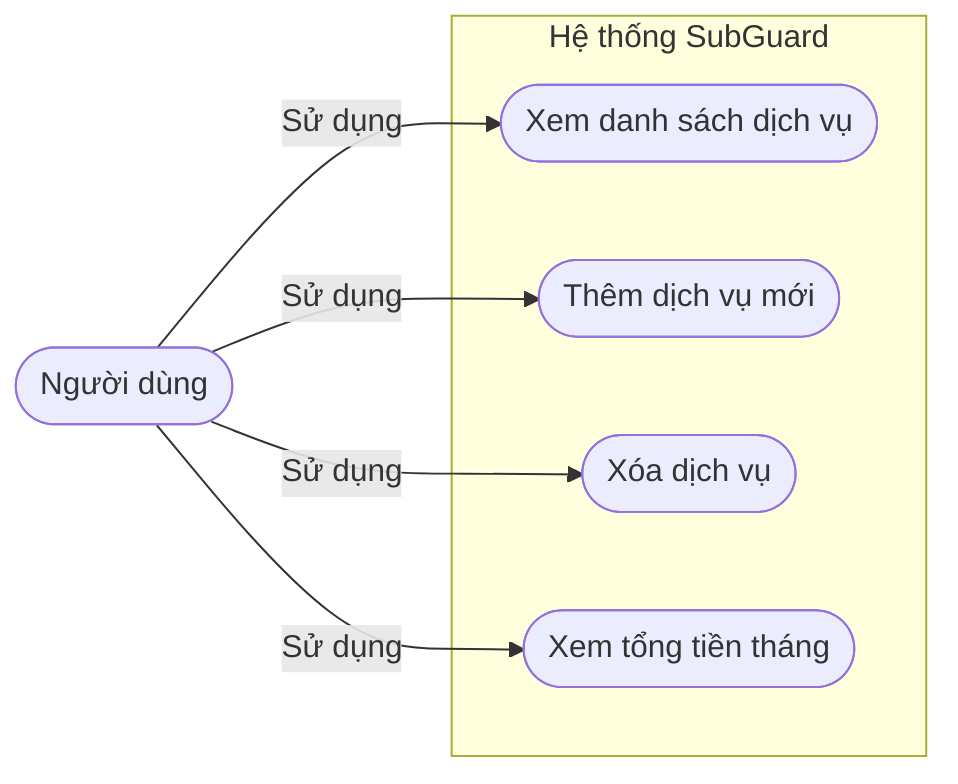
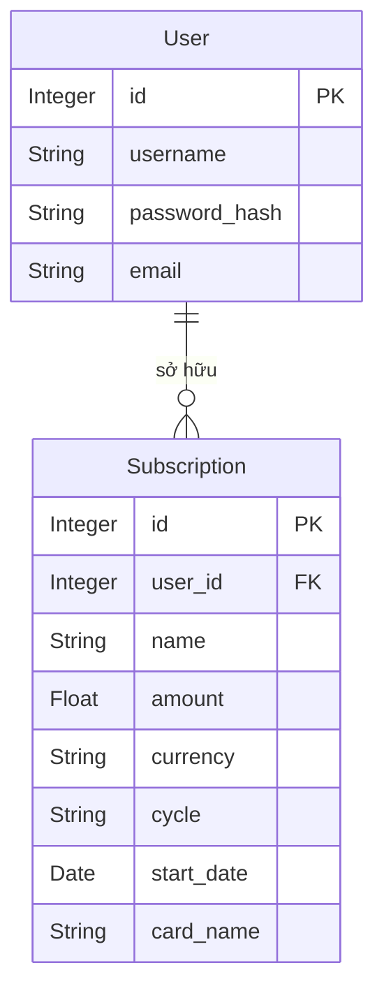
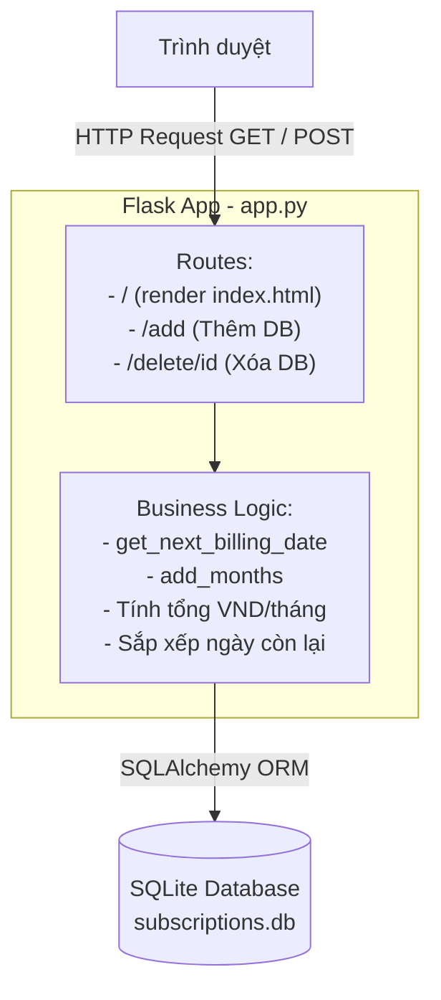

# FILE PHÂN TÍCH THIẾT KẾ

**Môn học:** Đồ án phần mềm Python  
**Họ và tên sinh viên:** Nguyễn Đình Tuấn Anh  
**Mã sinh viên:** LT22026162  
**Tên đề tài:** Xây dựng phần mềm quản lý và cảnh báo chi phí dịch vụ định kỳ  

---

## 1. GIỚI THIỆU

### 1.1. Mô tả chương trình phần mềm

**SubGuard** là ứng dụng web quản lý chi phí dịch vụ đăng ký định kỳ (subscription), cho phép người dùng theo dõi các dịch vụ như Netflix, Spotify, iCloud, ... Ứng dụng tự động tính toán số ngày còn lại đến kỳ thanh toán tiếp theo, cảnh báo trực quan bằng màu sắc và tính tổng số tiền phải trả trong tháng hiện tại (hỗ trợ đa tiền tệ VND/USD).

Phần mềm được xây dựng theo mô hình ứng dụng web:

| Thành phần | Công nghệ |
|---|---|
| Backend | Python 3, Flask 3.0 |
| Cơ sở dữ liệu | SQLite qua Flask-SQLAlchemy 3.1 |
| Giao diện | Jinja2, Tailwind CSS (CDN), Font Awesome 6 |
| Font chữ | Inter (Google Fonts) |
| Cấu hình | Biến trực tiếp trong `app.py` |

### 1.2. Mục tiêu và phạm vi

- **Mục tiêu:** Hỗ trợ người dùng không bị "rò rỉ tiền" vô tình từ các dịch vụ đăng ký tự động gia hạn. Ứng dụng cảnh báo chủ động bằng màu sắc khi dịch vụ sắp đến kỳ thanh toán và tổng hợp số tiền cần chi trong tháng.
- **Phạm vi hiện tại:** Thêm/xóa dịch vụ, xem danh sách dịch vụ với thẻ (card) màu sắc theo mức độ cấp bách, xem tổng tiền trong tháng (đã quy đổi về VND).
- **Đối tượng sử dụng:** Cá nhân sử dụng nhiều dịch vụ đăng ký trả phí định kỳ.

### 1.3. Cấu trúc thư mục dự án

```
PythonProject/
├── app.py                  # Ứng dụng Flask chính, routes, business logic
├── models.py               # Định nghĩa model SQLAlchemy (Subscription)
├── requirements.txt        # Các thư viện phụ thuộc
├── instance/
│   └── subscriptions.db    # Cơ sở dữ liệu SQLite (tự tạo khi chạy)
├── templates/
│   ├── base.html           # Template gốc, nhúng Tailwind CSS, layout chung
│   └── index.html          # Trang chính, hiển thị dashboard và danh sách thẻ
└── static/
    └── style.css           # (Placeholder, styling chuyển sang Tailwind)
```

---

## 2. PHÂN TÍCH HỆ THỐNG

### 2.1. Yêu cầu chức năng

| STT | Chức năng | Mô tả | Trạng thái |
|---|---|---|---|
| F1 | Xem danh sách dịch vụ | Hiển thị tất cả dịch vụ dưới dạng thẻ (card) với màu sắc cảnh báo | Đã triển khai |
| F2 | Thêm dịch vụ | Form modal: tên, số tiền, tiền tệ, chu kỳ, ngày bắt đầu, thẻ thanh toán | Đã triển khai |
| F3 | Xóa dịch vụ | Nút xóa trên từng thẻ, có xác nhận (confirm dialog) | Đã triển khai |
| F4 | Tính ngày còn lại (Countdown) | Tự động tính số ngày đến kỳ thanh toán tiếp theo | Đã triển khai |
| F5 | Cảnh báo màu sắc | Đỏ nhấp nháy (≤3 ngày), Vàng (≤7 ngày), Xanh (bình thường) | Đã triển khai |
| F6 | Tổng tiền tháng này | Cộng dồn chi phí của dịch vụ đến hạn trong tháng, quy đổi về VND | Đã triển khai |
| F7 | Quy đổi tiền tệ | Tỷ giá cố định: 1 USD = 25.000 VND | Đã triển khai |
| F8 | Sắp xếp dịch vụ | Danh sách tự động sắp theo ngày còn lại (tăng dần) | Đã triển khai |
| F9 | Sửa dịch vụ | Chỉnh sửa thông tin dịch vụ hiện có | Chưa triển khai |
| F10 | Lọc/tìm kiếm | Lọc theo loại tiền tệ, chu kỳ hoặc tên dịch vụ | Chưa triển khai |

### 2.2. Yêu cầu phi chức năng

- **Tính toán chính xác:** Xử lý đúng chu kỳ tháng/năm, bao gồm cả trường hợp năm nhuận (ngày 29/2 → 28/2 ở năm không nhuận).
- **Giao diện thân thiện:** Responsive trên mọi kích thước màn hình; dùng Tailwind CSS với phong cách Shadcn UI (bo góc lớn, bóng đổ mượt, gradient nền).
- **Khả năng mở rộng:** Tách `models.py` riêng biệt; cấu trúc route rõ ràng để dễ thêm tính năng mới (sửa, lọc, xác thực người dùng).
- **Không cần build:** Tailwind CSS qua CDN, không cần Node.js hay bước build phức tạp.

### 2.3. Sơ đồ Use Case (tóm tắt)



### 2.4. Quan hệ thực thể (ER Diagram)


*(Ghi chú: Sơ đồ ERD có tích hợp xác thực người dùng, mỗi tài khoản quản lý một danh sách dịch vụ riêng biệt)*

---

## 3. THIẾT KẾ CÁC ĐỐI TƯỢNG

### 3.1. Lớp Subscription (Dịch vụ đăng ký)

**Vai trò:** Đại diện cho một dịch vụ trả phí định kỳ mà người dùng đang theo dõi. Kế thừa `db.Model` (SQLAlchemy).

**Thuộc tính:**

| Thuộc tính | Kiểu | Mô tả |
|---|---|---|
| `id` | Integer, PK | Khóa chính, tự tăng |
| `name` | String(100), NOT NULL | Tên dịch vụ (vd: Netflix, Spotify) |
| `amount` | Float, NOT NULL | Số tiền thanh toán mỗi kỳ |
| `currency` | String(10), NOT NULL | Đơn vị tiền tệ: `'VND'` hoặc `'USD'`, mặc định `'VND'` |
| `cycle` | String(20), NOT NULL | Chu kỳ: `'monthly'` hoặc `'yearly'`, mặc định `'monthly'` |
| `start_date` | Date, NOT NULL | Ngày bắt đầu đăng ký (làm mốc tính chu kỳ) |
| `card_name` | String(100), NOT NULL | Tên thẻ/ví dùng để thanh toán |

**Phương thức đặc biệt:**

| Phương thức | Mô tả |
|---|---|
| `__repr__()` | Trả về chuỗi `<Subscription {name}>` để debug |

**Ví dụ khởi tạo:**
```python
new_sub = Subscription(
    name="Netflix",
    amount=180000,
    currency="VND",
    cycle="monthly",
    start_date=date(2024, 1, 15),
    card_name="Visa Techcombank"
)
```

---

## 4. THUẬT TOÁN VÀ XỬ LÝ NGHIỆP VỤ

### 4.1. Thuật toán tính ngày tiếp theo trong chu kỳ tháng (`add_months`)

**Đầu vào:** `sourcedate` (ngày gốc), `months` (số tháng cần cộng thêm)  
**Đầu ra:** Đối tượng `date` sau khi cộng thêm `months` tháng

```python
def add_months(sourcedate, months):
    month = sourcedate.month - 1 + months
    year  = sourcedate.year + month // 12
    month = month % 12 + 1
    # Xử lý ngày cuối tháng (vd: 31/1 + 1 tháng → 28/2)
    day   = min(sourcedate.day, calendar.monthrange(year, month)[1])
    return date(year, month, day)
```

**Ghi chú:** Dùng `calendar.monthrange` để lấy số ngày tối đa của tháng đích, tránh lỗi khi ngày 31 + 1 tháng rơi vào tháng chỉ có 30 ngày.

### 4.2. Thuật toán tính kỳ thanh toán tiếp theo (`get_next_billing_date`)

**Đầu vào:** `start_date` (ngày bắt đầu đăng ký), `cycle` (`'monthly'` hoặc `'yearly'`)  
**Đầu ra:** Ngày thanh toán kỳ tiếp theo (≥ ngày hôm nay)

**Pseudocode:**
```
Nếu start_date > ngày hôm nay:
    Trả về start_date  (dịch vụ chưa bắt đầu)

Nếu cycle == 'monthly':
    months_diff ← số tháng từ start_date đến hôm nay
    next_date   ← add_months(start_date, months_diff)
    Nếu next_date < hôm nay:
        next_date ← add_months(start_date, months_diff + 1)
    Trả về next_date

Nếu cycle == 'yearly':
    years_diff ← năm hiện tại - năm start_date
    next_date  ← start_date.replace(year = start_date.year + years_diff)
        (bắt lỗi ValueError để xử lý 29/2 năm nhuận → 28/2)
    Nếu next_date < hôm nay:
        next_date ← start_date.replace(year = start_date.year + years_diff + 1)
    Trả về next_date
```

**Độ phức tạp:** O(1) — không phụ thuộc số lượng dữ liệu, chỉ tính toán số học thuần túy.

### 4.3. Thuật toán tính tổng tiền trong tháng & quy đổi tiền tệ

**Đầu vào:** Danh sách tất cả `Subscription` trong database, ngày hôm nay  
**Đầu ra:** `total_vnd_this_month` — tổng chi phí trong tháng hiện tại quy ra VND

```
USD_TO_VND_RATE ← 25000

total_vnd_this_month ← 0

Với mỗi sub trong danh sách dịch vụ:
    next_date ← get_next_billing_date(sub.start_date, sub.cycle)
    Nếu next_date.month == tháng_hiện_tại AND next_date.year == năm_hiện_tại:
        Nếu sub.currency == 'USD':
            total_vnd_this_month += sub.amount × USD_TO_VND_RATE
        Ngược lại (VND):
            total_vnd_this_month += sub.amount
```

**Độ phức tạp:** O(n) với n = số dịch vụ đang theo dõi.  
**Cấu trúc dữ liệu:** Biến số thực (`Float`) để tích lũy tổng.

### 4.4. Thuật toán sắp xếp và phân loại màu sắc

**Đầu vào:** Danh sách `enriched_subs` đã có trường `days_remaining`  
**Đầu ra:** Danh sách được sắp xếp và gán `status_class` (class CSS) tương ứng

```
enriched_subs.sort(key = lambda x: x['days_remaining'])
```

**Phân loại màu trong Jinja2:**
```
Với mỗi sub:
    Nếu sub.days_remaining <= 3:  class = 'border-destructive animate-blink'  (Đỏ nhấp nháy)
    Nếu sub.days_remaining <= 7:  class = 'border-amber-500'                  (Vàng)
    Ngược lại:                    class = 'border-emerald-500/50'              (Xanh)
```

### 4.5. Thuật toán thêm dịch vụ mới

**Đầu vào:** Dữ liệu form POST (`name`, `amount`, `currency`, `cycle`, `start_date`, `card_name`)

```
1. Lấy name      ← form['name']
2. Lấy amount    ← float(form['amount'])
3. Lấy currency  ← form['currency']       // 'VND' hoặc 'USD'
4. Lấy cycle     ← form['cycle']          // 'monthly' hoặc 'yearly'
5. Parse start_date ← datetime.strptime(form['start_date'], '%Y-%m-%d').date()
6. Lấy card_name ← form['card_name']
7. Tạo new_sub   ← Subscription(name, amount, currency, cycle, start_date, card_name)
8. db.session.add(new_sub)
9. db.session.commit()
10. redirect về trang chủ ('/')
```

### 4.6. Thuật toán xóa dịch vụ

**Đầu vào:** `sub_id` (ID của dịch vụ cần xóa) từ URL

```
1. sub ← Subscription.query.get_or_404(sub_id)
   // Nếu không tìm thấy → tự động trả về lỗi 404
2. db.session.delete(sub)
3. db.session.commit()
4. redirect về trang chủ ('/')
```

---

## 5. KIẾN TRÚC PHẦN MỀM

### 5.1. Mô hình MVC trên Flask

| Lớp MVC | Thành phần trong dự án | Mô tả |
|---|---|---|
| Model | `models.py` — `Subscription` | Định nghĩa cấu trúc dữ liệu, tương tác DB |
| View | `templates/base.html`, `templates/index.html` | Jinja2 render HTML gửi về trình duyệt |
| Controller | `app.py` — các route (`/`, `/add`, `/delete`) | Xử lý request, gọi model, gọi view |

### 5.2. Sơ đồ kiến trúc tổng quan



### 5.3. Bảng ánh xạ Route – Chức năng

| Route | Method | Chức năng |
|---|---|---|
| `/` | GET | Trang chủ: lấy danh sách dịch vụ, tính ngày còn lại, tổng tiền tháng → render `index.html` |
| `/add` | POST | Nhận form thêm dịch vụ, tạo bản ghi mới trong DB, redirect `/` |
| `/delete/<int:sub_id>` | POST | Tìm dịch vụ theo ID, xóa khỏi DB, redirect `/` |

### 5.4. Thiết kế Giao diện (UI Design)

Giao diện xây dựng theo phong cách **Shadcn UI** (clone bằng Tailwind CSS):

| Thành phần | Mô tả thiết kế |
|---|---|
| Nền (Background) | Gradient chéo: `from-blue-50 via-white to-cyan-50` |
| Header | Sticky, có blur backdrop, viền dưới mỏng |
| Thẻ tóm tắt (Summary Card) | Bo góc lớn, hiển thị tổng tiền VND tháng này |
| Thẻ dịch vụ (Service Card) | `rounded-2xl`, shadow-sm, hover nảy lên (`-translate-y-1`) |
| Viền cảnh báo | Đỏ nhấp nháy / Vàng / Xanh tùy `days_remaining` |
| Modal thêm dịch vụ | Overlay mờ (`bg-black/80 backdrop-blur-sm`), form dạng Grid |
| Nút bấm | Bo tròn hoàn toàn (`rounded-full`), hover nhẹ bồng lên |
| Font chữ | Inter (Google Fonts) — rõ ràng, hiện đại |

---

## 6. KẾT LUẬN

### 6.1. Những gì đã hoàn thành

- Xây dựng hoàn chỉnh ứng dụng web Flask với đầy đủ tính năng cốt lõi theo đề bài.
- Viết thuật toán Python tính ngày đáo hạn chính xác cho cả chu kỳ tháng và năm, xử lý đúng biên (năm nhuận, ngày cuối tháng).
- Tích hợp quy đổi tiền tệ USD ↔ VND cơ bản (tỷ giá cố định 25.000).
- Thể hiện đúng yêu cầu Jinja2: dùng vòng lặp `` để render thẻ, dùng `` để điều kiện màu sắc và hoạt ảnh nhấp nháy.
- Thiết kế giao diện hiện đại, thân thiện, responsive bằng Tailwind CSS theo phong cách Shadcn UI.

### 6.2. Hướng phát triển tiếp theo

- Thêm tính năng xác thực người dùng (Flask-Login) để mỗi người quản lý danh sách riêng.
- Thêm tính năng sửa dịch vụ (Edit) trực tiếp trên giao diện.
- Gửi email/thông báo tự động khi dịch vụ còn ≤ 3 ngày (APScheduler + Flask-Mail).
- Lấy tỷ giá USD/VND theo thời gian thực qua API (vd: ExchangeRate-API).
- Thêm bộ lọc và thống kê chi phí theo tháng/năm dạng biểu đồ.
