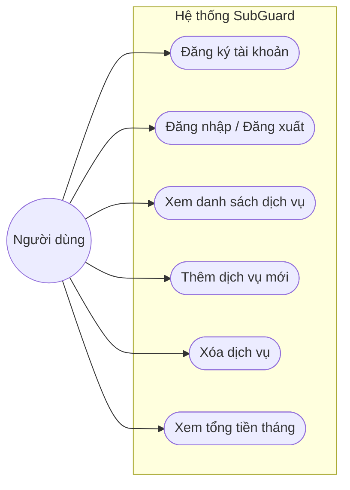
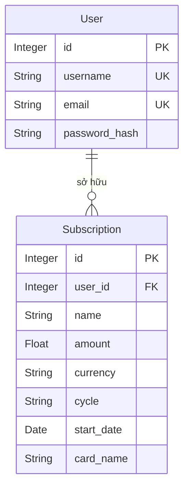
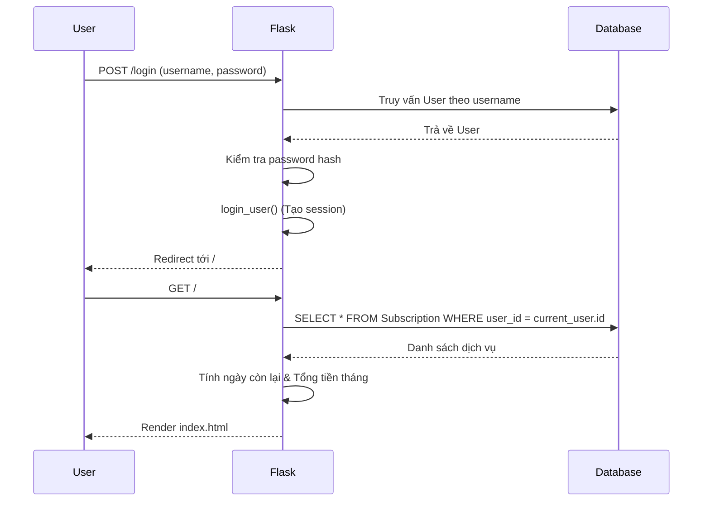

# TÀI LIỆU PHÂN TÍCH VÀ THIẾT KẾ PHẦN MỀM
## Ứng dụng Quản lý và cảnh báo chi phí dịch vụ định kỳ (SubGuard)

---

## MỤC LỤC

1. [Giới thiệu](#1-giới-thiệu)
2. [Phân tích hệ thống](#2-phân-tích-hệ-thống)
3. [Thiết kế các đối tượng](#3-thiết-kế-các-đối-tượng)
4. [Thuật toán và xử lý nghiệp vụ](#4-thuật-toán-và-xử-lý-nghiệp-vụ)
5. [Kiến trúc phần mềm](#5-kiến-trúc-phần-mềm)
6. [Luồng xử lý chính](#6-luồng-xử-lý-chính)
7. [Giao diện người dùng](#7-giao-diện-người-dùng)
8. [Hạn chế và hướng phát triển](#8-hạn-chế-và-hướng-phát-triển)

---

## 1. GIỚI THIỆU

### 1.1. Mô tả chương trình phần mềm

**SubGuard** là ứng dụng web quản lý chi phí dịch vụ đăng ký định kỳ (subscription), cho phép người dùng cá nhân theo dõi các dịch vụ như Netflix, Spotify, iCloud... Ứng dụng tự động tính toán số ngày còn lại đến kỳ thanh toán tiếp theo, cảnh báo trực quan bằng màu sắc và tính tổng số tiền phải trả trong tháng hiện tại. Phiên bản này tích hợp chức năng **đăng ký, đăng nhập**, đảm bảo mỗi người dùng có không gian quản lý danh sách dịch vụ riêng biệt và bảo mật.

Phần mềm được xây dựng theo mô hình **ứng dụng web ba lớp** (presentation – business logic – data):

| Thành phần | Công nghệ |
|------------|-----------|
| Backend | Python 3, Flask 3.0 |
| Cơ sở dữ liệu | SQLite qua Flask-SQLAlchemy 3.1 |
| Xác thực | Flask-Login, Werkzeug (mã hóa mật khẩu) |
| Giao diện | Jinja2, Tailwind CSS (CDN), Font Awesome 6 |
| Cấu hình | Biến trực tiếp trong `app.py` |

### 1.2. Mục tiêu và phạm vi

- **Mục tiêu:** Hỗ trợ người dùng theo dõi và kiểm soát các chi phí đăng ký định kỳ, chống "rò rỉ tiền" do quên hủy dịch vụ. Ứng dụng cảnh báo chủ động khi sắp đến kỳ hạn thanh toán.
- **Phạm vi hiện tại:** Đăng ký/đăng nhập, thêm/xóa dịch vụ, xem danh sách thẻ dịch vụ, cảnh báo màu sắc, xem tổng tiền tháng đã quy đổi.
- **Đối tượng sử dụng:** Cá nhân có nhiều dịch vụ trả phí định kỳ, cần quản lý chi tiêu.

### 1.3. Cấu trúc thư mục dự án

```text
PythonProject/
├── app.py                  # Điểm vào chính, định nghĩa routes, logic xác thực và nghiệp vụ
├── models.py               # Mô hình dữ liệu SQLAlchemy (User, Subscription)
├── requirements.txt        # Các thư viện phụ thuộc Python
├── instance/
│   └── subscriptions.db    # Cơ sở dữ liệu SQLite (tự động tạo)
├── templates/
│   ├── base.html           # Template gốc, nhúng Tailwind CSS, navbar
│   ├── index.html          # Dashboard, danh sách dịch vụ
│   ├── login.html          # Trang đăng nhập
│   └── register.html       # Trang đăng ký
└── static/
    └── style.css           # File CSS bổ sung
```

---

## 2. PHÂN TÍCH HỆ THỐNG

### 2.1. Yêu cầu chức năng

| STT | Chức năng | Mô tả | Trạng thái |
|-----|-----------|-------|------------|
| F1 | Đăng ký tài khoản | Tạo user mới với username, email, mật khẩu mã hóa | Đã triển khai |
| F2 | Đăng nhập / Đăng xuất | Xác thực session qua Flask-Login, bảo vệ trang chủ | Đã triển khai |
| F3 | Xem danh sách dịch vụ | Hiển thị tất cả dịch vụ của **người dùng hiện tại** dưới dạng thẻ với màu cảnh báo | Đã triển khai |
| F4 | Thêm dịch vụ | Form: tên, số tiền, tiền tệ, chu kỳ, ngày bắt đầu, thẻ thanh toán | Đã triển khai |
| F5 | Xóa dịch vụ | Nút xóa trên thẻ, yêu cầu xác nhận | Đã triển khai |
| F6 | Tính ngày & Cảnh báo | Tự động tính số ngày còn lại; Đỏ (≤3 ngày), Vàng (≤7 ngày), Xanh | Đã triển khai |
| F7 | Tổng tiền tháng này | Cộng dồn chi phí dịch vụ đến hạn trong tháng, quy đổi về VND | Đã triển khai |
| F8 | Chỉnh sửa dịch vụ | Thay đổi thông tin dịch vụ | Chưa triển khai |

### 2.2. Yêu cầu phi chức năng

- **Bảo mật:** Mật khẩu phải được băm (hash) bằng Werkzeug. Các thao tác xem/thêm/xóa dịch vụ phải kiểm tra `current_user.is_authenticated`. Dịch vụ của user nào thì chỉ user đó thấy và xóa được.
- **Tính toán chính xác:** Thuật toán tính ngày đáo hạn phải xử lý được năm nhuận, tháng thiếu.
- **Giao diện:** Thân thiện, đáp ứng (responsive), phong cách thiết kế hiện đại (bo góc, đổ bóng) dùng Tailwind CSS.

### 2.3. Sơ đồ use case (tóm tắt)



### 2.4. Quan hệ thực thể (ER)



- Một **User** có nhiều **Subscription** (1–N).
- Mỗi **Subscription** bắt buộc thuộc về một **User**.

---

## 3. THIẾT KẾ CÁC ĐỐI TƯỢNG

### 3.1. Lớp `User` (Người dùng)

**Vai trò:** Quản lý thông tin đăng nhập, kế thừa `UserMixin` của Flask-Login.

| Thuộc tính | Kiểu | Mô tả |
|------------|------|--------|
| `id` | Integer, PK | Khóa chính |
| `username` | String(64), unique | Tên đăng nhập |
| `email` | String(120), unique | Email |
| `password_hash` | String(256) | Mật khẩu đã băm qua `werkzeug.security` |
| `subscriptions`| Relationship | Danh sách dịch vụ của người dùng (`backref='owner'`) |

**Phương thức:**
- `set_password(password)`: Tạo mã băm cho mật khẩu.
- `check_password(password)`: Kiểm tra mật khẩu đầu vào.

---

### 3.2. Lớp `Subscription` (Dịch vụ)

**Vai trò:** Đại diện cho một dịch vụ trả phí định kỳ của một người dùng.

| Thuộc tính | Kiểu | Mô tả |
|------------|------|--------|
| `id` | Integer, PK | Khóa chính |
| `user_id` | Integer, FK | Tham chiếu tới `User.id` |
| `name` | String(100) | Tên dịch vụ (vd: Netflix) |
| `amount` | Float | Số tiền thanh toán |
| `currency` | String(10) | Tiền tệ (`VND` hoặc `USD`) |
| `cycle` | String(20) | Chu kỳ (`monthly` hoặc `yearly`) |
| `start_date`| Date | Ngày bắt đầu |
| `card_name` | String(100) | Tên thẻ thanh toán |

---

### 3.3. Đối tượng cấu hình và tiện ích

- `db`: Thể hiện của `SQLAlchemy`.
- `login_manager`: Thể hiện của `LoginManager`, `login_view = 'login'`.

---

## 4. THUẬT TOÁN VÀ XỬ LÝ NGHIỆP VỤ

### 4.1. Xác thực người dùng (Auth)

- **Đăng ký:** Nhận `username`, `email`, `password`. Băm `password` bằng `generate_password_hash`. Lưu `User` vào DB.
- **Đăng nhập:** Truy vấn `User` qua `username`. Dùng `check_password_hash` kiểm tra. Gọi `login_user(user)` để tạo phiên (session).
- **Phân quyền:** Dùng decorator `@login_required` cho route `/`, `/add`, `/delete`. Mọi truy vấn `Subscription` đều đính kèm điều kiện `user_id == current_user.id`.

### 4.2. Thuật toán tính ngày tiếp theo trong chu kỳ tháng (`add_months`)

**Mục đích:** Cộng chính xác số tháng vào ngày hiện tại, xử lý các ngày cuối tháng.

```python
def add_months(sourcedate, months):
    month = sourcedate.month - 1 + months
    year  = sourcedate.year + month // 12
    month = month % 12 + 1
    day   = min(sourcedate.day, calendar.monthrange(year, month)[1])
    return date(year, month, day)
```

### 4.3. Thuật toán tính kỳ thanh toán tiếp theo (`get_next_billing_date`)

**Mục đích:** Tìm ngày thanh toán tiếp theo ≥ ngày hôm nay dựa vào `start_date` và `cycle`.

```
Nếu cycle == 'monthly':
    months_diff ← số tháng từ start_date đến hôm nay
    next_date   ← add_months(start_date, months_diff)
    Nếu next_date < hôm nay:
        next_date ← add_months(start_date, months_diff + 1)

Nếu cycle == 'yearly':
    years_diff ← năm hiện tại - năm start_date
    next_date  ← start_date.replace(year = start_date.year + years_diff)
    Nếu next_date < hôm nay:
        next_date ← start_date.replace(year = start_date.year + years_diff + 1)
```

### 4.4. Thuật toán tính tổng chi phí tháng hiện tại

Duyệt danh sách dịch vụ của `current_user`. Tìm ngày thanh toán tiếp theo. Nếu ngày thanh toán rơi vào **tháng và năm hiện tại**, cộng dồn tiền (nếu USD thì nhân tỷ giá 25.000).

---

## 5. KIẾN TRÚC PHẦN MỀM

### 5.1. Bảng ánh xạ Route – Chức năng

| Route | Method | Bảo vệ | Chức năng |
|-------|--------|--------|-----------|
| `/` | GET | `@login_required` | Dashboard, danh sách dịch vụ của user |
| `/login` | GET, POST | Public | Form đăng nhập |
| `/register`| GET, POST | Public | Form đăng ký tài khoản |
| `/logout` | GET | `@login_required` | Đăng xuất, hủy session |
| `/add` | POST | `@login_required` | Thêm dịch vụ (gắn `user_id`) |
| `/delete/<id>` | POST | `@login_required` | Xóa dịch vụ (phải thuộc về `current_user`) |

---

## 6. LUỒNG XỬ LÝ CHÍNH

### 6.1. Luồng đăng nhập và xem Dashboard



---

## 7. GIAO DIỆN NGƯỜI DÙNG

- **Giao diện:** Thiết kế theo phong cách Shadcn UI (bo góc, bóng mượt, dùng Tailwind CSS).
- **Màu sắc cảnh báo:**
  - `days_remaining <= 3`: Đỏ nhấp nháy (`animate-pulse`).
  - `days_remaining <= 7`: Vàng cam.
  - Bình thường: Xanh lam nhạt / Ngọc bích.
- **Responsive:** Dạng lưới lưới linh hoạt (Grid/Flexbox) hoạt động tốt trên cả Mobile và Desktop.

---

## 8. HẠN CHẾ VÀ HƯỚNG PHÁT TRIỂN

### 8.1. Hạn chế
- Chưa có tính năng xác thực email thực tế.
- Tỷ giá USD/VND đang được hardcode.
- Chưa có chức năng chỉnh sửa dịch vụ (Edit).

### 8.2. Hướng phát triển
1. Hoàn thiện API lấy tỷ giá USD ngoại tệ thực tế.
2. Thêm tính năng sửa dịch vụ trực tiếp.
3. Thêm gửi email nhắc nhở tự động khi dịch vụ sắp đến hạn (Dùng Celery hoặc APScheduler).
